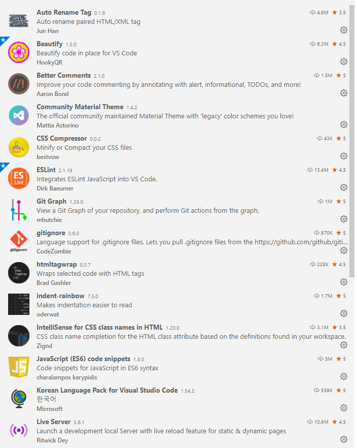
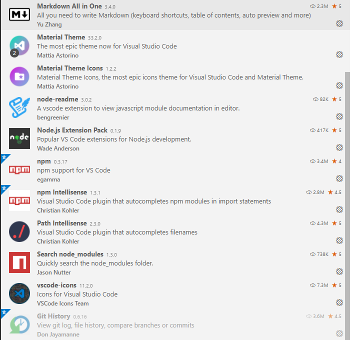

# node.js 개발환경 구축
## 설치
1. node.js
	- 다운로드 설치: [노드설치](https://nodejs.org) - LTS(운영서버), Latest
	- nvm 설치 [window nvm 설치](https://seunghyun90.tistory.com/52)

2. vscode 확장기능
	- 
	- 

3. [git-scm 설치](https://git-scm.com)
	- 사용자 등록:
	```bash
	git config --global user.name 'booldook'
	git config --global user.email 'booldook@gmail.com'
	```
4. global program - nodemon
	```bash
	npm i -g nodemon
	```

5. 프로젝트 설정
	- 작업폴더 만들고 vscode에서 작업폴더 열기 후...
	```bash
	npm init -y
	npm i express...
	```
